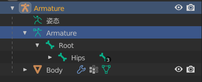

[TOC]

# 一、导入原神模型替换小白人

## 1.1	PMX模型下载

[模之屋](https://www.aplaybox.com/)

## 1.2	PMX模型 => FBX模型

### 1.2.1	使用工具

- **Blender 2.93**
- **cats-blender-plugin-0-19-0**

### 1.2.2	操作流程

- 导入**pmx**模型

- 在右侧边栏中，选择**CATS**，点击**Fix Model**

  - 修复完成后，模型会显示着色

- 进入**编辑模式**

  - 添加骨骼，重命名为**Root**

  - 将**Hips**的父骨骼设置为**Root**

  - 修改骨骼姿势的名称为**Armature**，与上面保持一致

    

- 进入**物体模式**，删除场景中多余物体

- **选中模型，点击S，输入0.1**：将模型缩放为0.1倍

- 导出为**fbx**模型

  - **几何数据|平滑**：面
  - **骨架|添加叶骨**：取消勾选
  - **烘焙动画**：取消勾选

## 1.3	FBX模型 => UE5

- 直接拖拽进去，选择**导入所有**

## 1.4	动画重定向

### 1.4.1	动作资产

- **虚幻商城|EPIC内容**：Paragon:Aurora